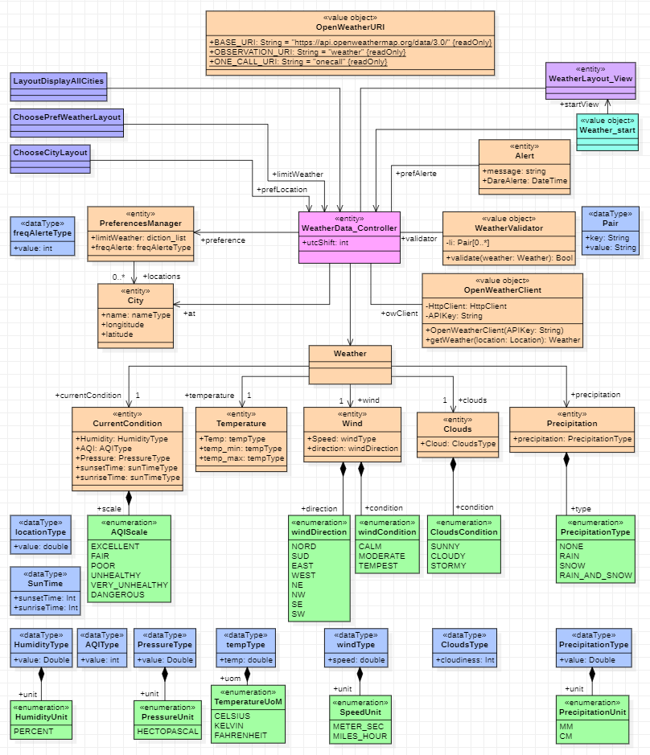

# M1 MIAGE FA - PROG AV - Gilles POIROT

**Réalisation d'une application météorologique orientée sur les événements climatiques extrêmes**

> Groupe : Patrice, Samir, Mehdi

## Fonctionnalités

    - Remontée des alertes sur des conditions météo déterminées par l'utilisateur
    - Possibilité d'ajout de plusieurs localisations
    - Système de stockage des préférences de l'utilisateur
    - Choix de la fréquence de raffraichissement des données par l'utilsateur
    - Choix d'une ville principale
    - Utilisation de méthodes de sycnhronisation (ex : async / await)

## Choix techniques

    - OS : Android 10
    - API : OpenWeather
    - Langage : Kotlin
    - IDE : Android Studio

 
- Notre application mobile permet à son utilisateur de connaitre les prévisions météorologiques avec les informations importantes. 
- L'utilisateur aura la possibilité de recevoir des alertes selon du niveau de température, d'humidité, et bien plus encore. 
- Toutes les informations que l'on affiche dans notre application proviennent de l'API de OpenWeather, choisi pour sa popularité et sa gratuité (pour peu de requêtes) et sa facilité d'utilisation dans une application android. 
- En effet, notre application tournera sous android 10 minimum, développée sous le langage Kotlin, sur l'environnement de développement Android Studio. 
- Le choix de coder cette application pour les téléphones android s'est fait naturellement du fait que chacun des membres de l'équipe dispose d'un téléphone tournant sur l'OS android 11. Nous sommes restés sur le choix de la version 10 d'android afin que plus de la moitié des téléphones actuels puissent installer notre application, tout en gardant les dernières fonctionnalités d'android. 
- Ensuite, le langage Kotlin a été choisi au profit du langage Java afin de s'exercer sur un langage plus récent et plus adapté au développement des appllications mobiles.
 
 
 

## Modélisation UML

 
